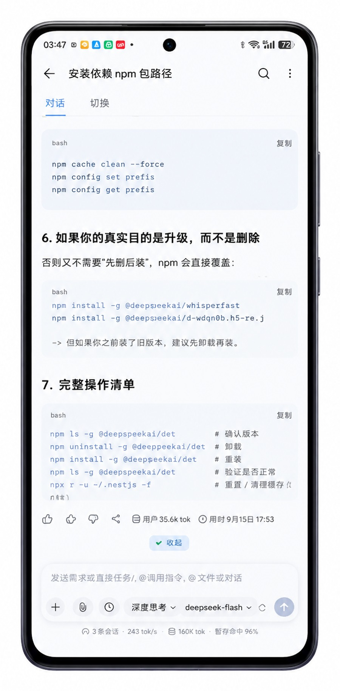
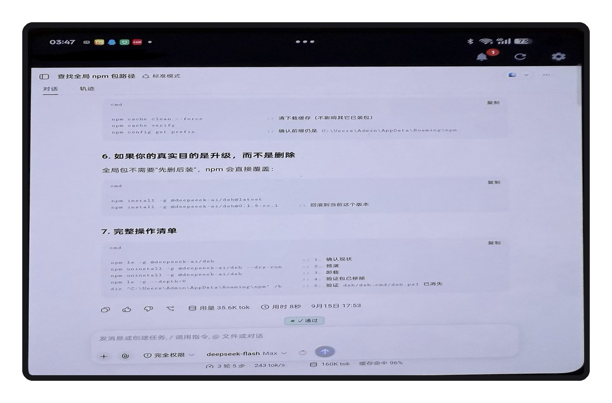

# dshgo

在手机 / 平板上用 DSH —— **一个 Android App，加一个让电脑可达的插件。**

| | |
|---|---|
| **[Android App](android/)** | 真正为手机做的客户端。输入法不挡输入框、能传附件、会话跑完推送通知、随时切换入口地址。[**下载 APK**](https://github.com/xiazhi88/dshgo/releases/latest/download/dshgo-app.apk) · [源码](android/) |
| **[插件](.)** | `dshgo`：把只监听 `127.0.0.1` 的 `dsh web` 暴露到局域网，并在设置里加一个「局域网访问」页签（地址 + 二维码）。 |

两者独立：App 也可以连你自己的隧道，插件也可以只给浏览器用。但配在一起是完整体验。

<p align="center">
  
  &nbsp;&nbsp;&nbsp;
  
</p>

> 上图由生图模型基于实拍照片重绘（去背景、正视角）。**屏幕里的文字是模型重画的**，
> 不是应用的真实界面内容 —— 想看忠实还原的版本见
> [`docs/tablet-faithful.jpg`](docs/tablet-faithful.jpg)。

```
┌─────────┐        局域网 / Tailscale        ┌──────────────────────┐
│ 手机 App │ ────────────────────────────────> │ dshgo :3081        │
│         │ <──────────────────────────────── │   ↓ 改写成 loopback   │
└─────────┘                                   │ dsh web  :3080       │
                                              └──────────────────────┘
```

同一台机器上的浏览器也能用 —— 打开 `设置 → 局域网访问` 就有地址和二维码。

---

## 为什么需要它

`dsh web` 有三道限制，手机端一条都绕不过去：

| 限制 | 说明 |
|---|---|
| **只绑 loopback** | `dsh web` 固定监听 `127.0.0.1`。官方明确禁了 `--host 0.0.0.0`：*"it would expose remote code execution to the network"* |
| **`/api` 有 Host/Origin 栅栏** | 只认 loopback（`127/8`、`localhost`、`::1`）或 `--trusted-host` 白名单，且 `Origin` 必须与 `Host` 同源 |
| **会话 cookie 绑定 authority** | cookie 名是 `dsh-auth-<authority 的 hash>`，校验时比对签发时的 authority |

所以手机即使能连上 3080，也会被栅栏 401。本插件把入站请求的 `Host`/`Origin`
统一改写成 `127.0.0.1:<dshPort>` 再转发 —— 栅栏永远看到 loopback，cookie 的
authority 也始终一致。

另外它还补两件小事：

- **首屏注入一次 launch token**：token 每次 `dsh web` 启动都会变，不带就永远拿不到会话 cookie
- **注入两个 polyfill**：`crypto.randomUUID` 在 `http://<IP>`（非安全上下文）里原生不可用，
  而 DSH 连接层拿它生成 RPC id；`AbortSignal.any` 在旧 WebView 上缺失会让发送消息直接失败

## DSH 版本要求

**最低 `0.1.2-rc.1`。**

插件本身任何版本都能跑（它只是转发），但**通知与应用内的会话状态**依赖两个服务端能力，
而它们都是 `0.1.2-alpha.2` 才加的：

| 能力 | 起始版本 | 谁声明 |
|---|---|---|
| `session/list` RPC | **0.1.2-alpha.2** | `@deepseek-ai/dsh-api-session-controller` |
| WebSocket 事件流 `/api/remote.mux` | **0.1.2-alpha.2** | `@deepseek-ai/dsh-api-gateway` 的 `registerUpgrade` |

版本过老时的表现（我们在这上面栽过）：

```
WebSocket 事件流 /api/remote.mux  → 服务端直接掐断（升级路由没注册）
session/list RPC                  → HTTP 404 not found（包都不存在）
```

> `0.1.2-alpha.2` 是最早同时具备两者的版本，但 alpha 不建议用 —— 所以写 `0.1.2-rc.1`。

**升级**：

```sh
npm i -g @deepseek-ai/dsh@latest
```

> App 侧对「太老」做了兜底：WS 连不上会自动退到轮询 `session/list`。
> 但那也要求 `session/list` 存在 —— 低于 `0.1.2-alpha.2` 时它是真的没有，
> 只能在界面上明确告诉你去升级。

## 安装

```sh
dsh plugin --profile web add github:xiazhi88/dshgo -w
# 然后重启 dsh web
```

已发布到 npm 之后可以简写成 `dsh plugin --profile web add dshgo -w`。

装完就有：**局域网入口**（设置 → 局域网访问，带二维码）、**移动端布局**、
大响应压缩、删除会话。移动端布局的代码已内联在本包里，**不需要另装
`dsh-web-mobile`**。

> **两个注意点**
>
> - **装完必须重启 `dsh web`。** 后端半只在启动时挂载。不重启的话页签会出现，
>   但会显示「服务端半没有运行」—— 不是装失败，是没重启。
> - **从旧名 `dsh-lan` 升级要先卸旧包**，否则设置里会多出一个同名的「局域网访问」
>   （两个包的页签 id 不同，不会被去重）：`dsh plugin --profile web remove dsh-lan`。
>   App 同理 —— `com.dsh.remote` 和 `com.dshgo.app` 是两个应用。

## 配置（可选）

在 profile 的 `cordis.patch.yml` 里：

```yaml
- id: dshgo
  config:
    port: 3081        # 对外端口，默认 3081
    bind: 0.0.0.0     # 对外绑定地址
```

端口被占用时会自动往后试 10 个（启动日志会打印实际用的那个），不影响 `dsh web` 本身。

## 设置页签

装上后 DSH 设置里会多一个一级入口 **「局域网访问」**（与「通用设置 / 模型 / 插件」同级）：


它展示：本机所有可用地址（点一下复制）、**从外面访问的引导**、监听状态。

### 公网访问（Tailscale）

本插件只暴露到局域网 —— 直接开端口转发是危险的：`dsh web` 没有登录口令，
暴露到公网等于把这台电脑的任意命令执行权交给扫描器。

推荐 Tailscale：设备级私有网络，点对点直连，不用开端口。

页签会**自动识别 Tailscale 是否已就绪** —— 服务端枚举网卡时就能认出
`100.64.0.0/10`（CGNAT 段）的地址，所以两种状态给的是不同内容：

| 已装 Tailscale | 未装 |
|---|---|
|  |  |

对应关系：

```
GET /__dshgo__/info
→ { "addresses": ["http://192.168.1.100:3081", "http://100.101.102.103:3081"],
    "tailscale": ["http://100.101.102.103:3081"] }
```

`tailscale` 非空即「已就绪」。它同时也是 `addresses` 的子集，所以老客户端不受影响。

实现上是 DSH 客户端插件的一个 slot：

```js
ctx.slots.inject('settings.section', () =>
  ctx.slots.register(
    { name: 'settings.section', id: 'dshgo', order: 2, label: () => '局域网访问' },
    LanSettings,
  ),
);
```

`client/client.js` 是**手写源码，没有构建步骤** —— 页面很简单，为它引入 esbuild
不划算。数据直接来自下面的自描述端点（与页面同源，不需要额外开 RPC 通道）。

## 自描述端点

```
GET /__dshgo__/info
→ {
    "name": "dshgo",
    "listening": true,                             // 转发代理到底有没有起来
    "port": 3081,                                  // 实际监听的端口（被占时可能是 3082…）
    "upstreamPort": 3080,
    "addresses": ["http://192.168.1.100:3081"],
    "tailscale": ["http://100.101.102.103:3081"]   // 是 addresses 的子集
  }
```

它注册在 **DSH 的 web server 上**，所以本机直连和走代理都能拿到：

| 访问方式 | 结果 |
|---|---|
| 本机 `http://127.0.0.1:3080/__dshgo__/info` | 直接命中 |
| 手机 `http://192.168.1.100:3081/__dshgo__/info` | 代理转发到 3080，同一个处理器 |

不需要认证（只回本机地址，不含敏感信息）。

## 安全

**它把能执行任意代码的 DSH 暴露到了局域网。** 请确认：

- 只在可信网络里开（家里 / 自己的 WiFi）
- 不要把地址或端口转发到公网
- 需要公网访问时，用带认证的隧道，别直接暴露这个端口

插件本身不做认证 —— 如果需要访问密码，那是另一个层面的需求，请用
[`dsh-pocket`](https://github.com/shaobeichen/dsh-pocket) 或自己的反向代理。

## 许可

本项目：MIT。

移动端布局与两项宿主功能内联自
[`dsh-web-mobile`](https://github.com/mexiaosqwq/dsh-web-mobile)，
MIT，Copyright (c) 2026 mexiaosqwq，
许可见 [`client/vendor/LICENSE.dsh-web-mobile`](client/vendor/LICENSE.dsh-web-mobile)。
