# DSH 口袋 · Android 客户端

把 Mac 上的 **DeepSeek Harness** 装进手机 / 平板。

**打开 app 就是 DSH 界面本身**，不在原生层重复它已经有的东西。
Release APK **1.4 MB**。

| 打开即 DSH | 设置面板 |
|---|---|
| 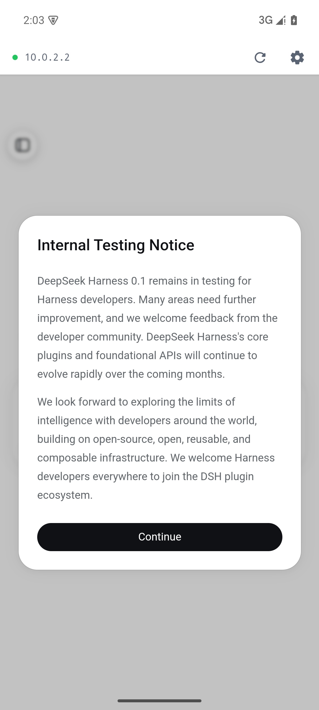 | 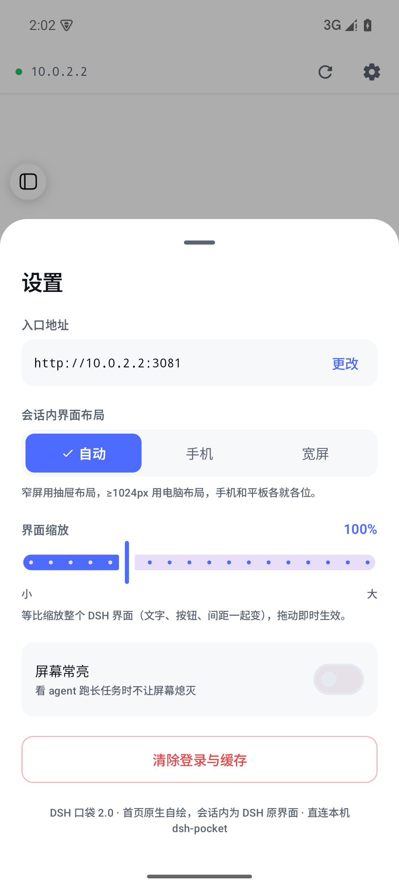 |

---

## 一、附件上传

DSH 输入框左侧的**回形针**是附件入口，走的是浏览器标准的 `<input type="file">`。

WebView 里这类控件**必须由宿主接管**：它在 [WebChromeClient.onShowFileChooser] 里
把选择请求抛给宿主，宿主不接管就等于丢弃 —— 表现就是「点了毫无反应」。

```kotlin
override fun onShowFileChooser(
    view: WebView,
    callback: ValueCallback<Array<Uri>>,
    params: FileChooserParams,
): Boolean {
    filePathCallback = callback
    fileChooser.launch(params.createIntent())   // ActivityResultLauncher
    return true
}
```

> **不需要任何权限。** 选文件走的是 SAF（`ACTION_GET_CONTENT`），系统按你选中的文件
> 逐次授权给 app。所以设置里找不到「图片/文件权限」开关是正常的 —— 本来就没有这个东西。

| 选中的图片已进入输入框 |
|---|
| 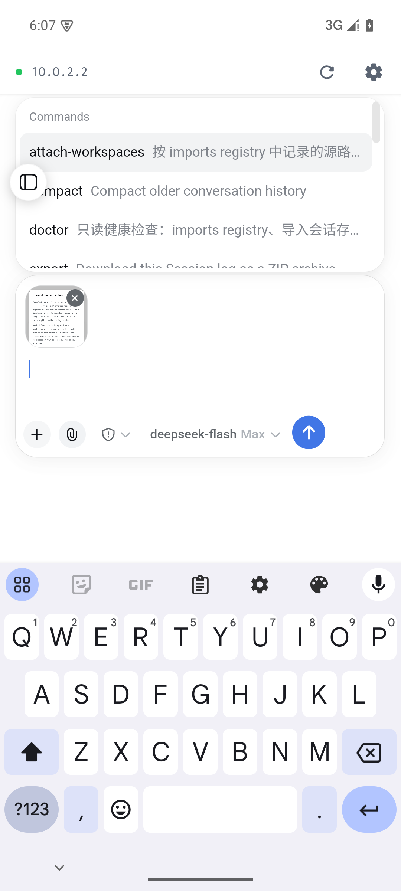 |

---

## 二、会话完成通知

右上角铃铛 → 悬浮窗；某条会话回答完成就推一条系统通知；点通知直接跳到那个会话。

| 通知列表 | 系统通知栏 | 开启后状态点变绿 |
|---|---|---|
| 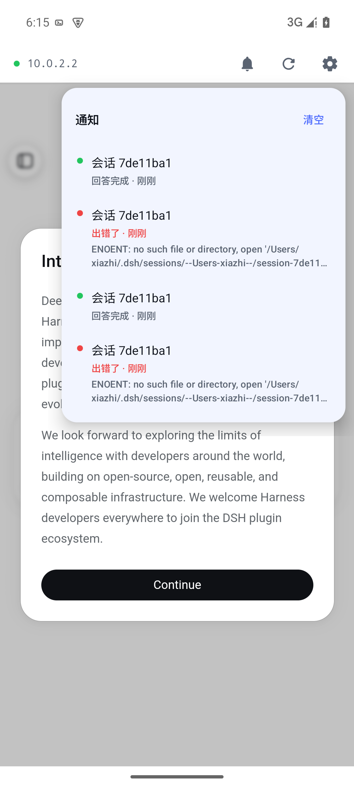 | 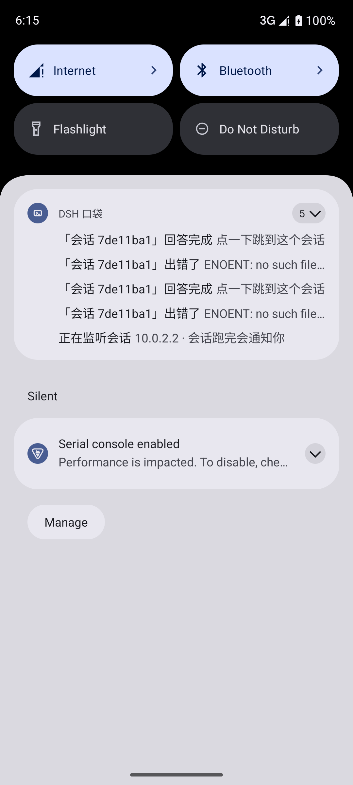 | 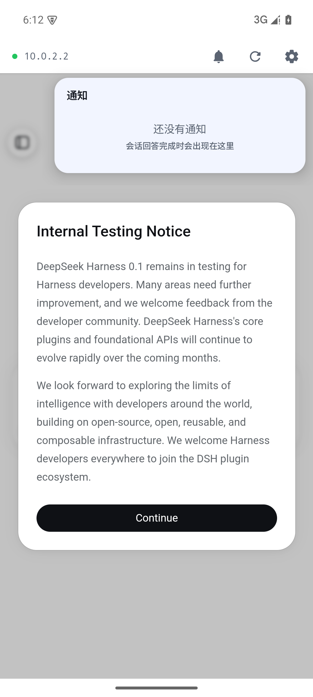 |

### 完成信号从哪来

事件流 `api-session/status(sessionId, running)` —— `running` 由 true 变 false 就是这一轮结束。
`api-session/error(sessionId, message)` 则记一条「出错了」。

启动时先拉一次 `session/list` 建两样东西：**id→标题的对照表**（事件里不带标题）
和**「已经在跑」的基线**（避免一启动就补发一堆历史通知）。

### 一个必须处理的坑：waterfall 回执

`approval/request`（工具审批）是 **waterfall** 模式：宿主会等**每个**订阅者表态。
会话内的 DSH 网页本来就在订阅同一条流 —— 原生侧再订一条却**不回执**的话，
宿主的 waterfall 会一直挂着，**把用户的审批卡死**。

所以对每个 waterfall 帧立刻回 `{kind:'next'}`（「我不处理，链条继续」）：

```
POST /api/$events/result
{"type":"client-request","rpcId":"…","method":"$events/result",
 "payload":{"args":{"clientId":"<ready 帧里的>","eventId":"<waterfall 帧里的>",
                    "outcome":{"kind":"next"}}}}
```

这样它只是旁观，永远不抢网页的活。

### 后台怎么活下来

app 退到后台几分钟就会被系统冻结，WebSocket 断掉，通知只能等你重新打开 app 才补上 ——
那就没意义了。所以开通知时会起一个 `WatchService`（`foregroundServiceType="dataSync"`），
代价是一条最低优先级的常驻通知，不响不震。关掉通知开关时服务一并停止。

### 点通知怎么跳到会话

DSH 前端**没有 URL 路由**（实测无 `pushState` / `URLSearchParams`），但它把当前会话
持久化在 `localStorage['dsh.sessions.current']`。写这个键再 `location.reload()`
是唯一可靠的深链方式 —— 冷启动时页面还没就绪，得等 `onPageFinished` 再注入。

---

## 三、界面布局由客户端自己控制

设置里的「界面布局」（自动 / 手机 / 宽屏）**不依赖任何插件**。

> **前提：这些布局模式本身不由 DSH 核心提供。**
> DSH 核心是纯桌面 Web UI —— `max-width: 1023px` 在核心里一次都没出现。
> 抽屉布局、移动端 CSS、触控优化来自
> **[`dsh-web-mobile`](https://github.com/mexiaosqwq/dsh-web-mobile)（MIT，v2.4.1，已在 npm 发布）**。
>
> 它本身就是一个完整的 DSH 插件包（自带 `dsh.bundle.patch` + `dsh.client`），
> 装一个包即可，**不需要移植代码**：
>
> ```sh
> dsh plugin --profile web add dsh-web-mobile -w
> ```
>
> 所以这个设置的真实语义是：**驱动已有的移动端适配切到哪一态**。
> 有适配就生效；没有的话 DSH 直接渲染桌面 UI，设置不产生可见变化（不报错，只是没东西可切）。

| 移动端适配生效（自动 / 手机） | 强制宽屏 |
|---|---|
| 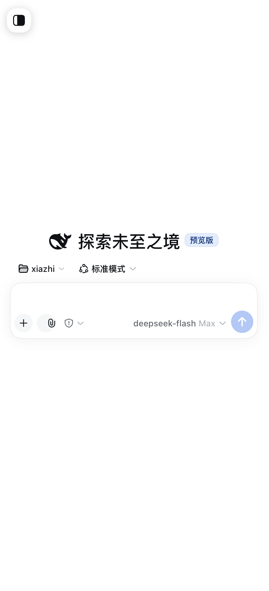 | 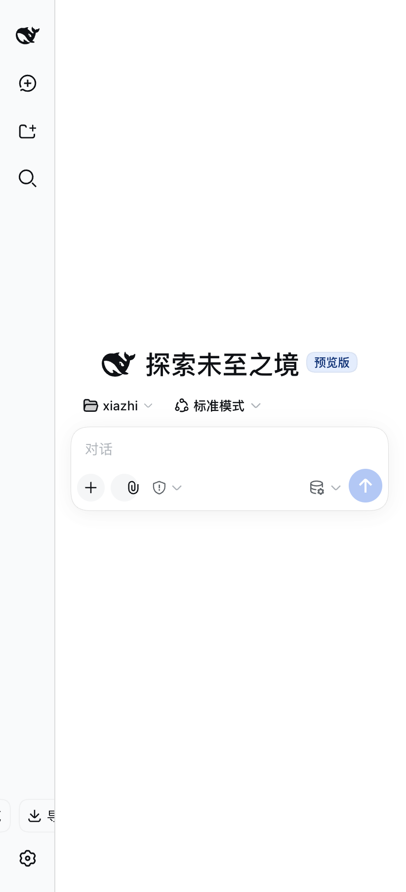 |

### 为什么不能改 CSS、也不能改视口

DSH 决定用抽屉还是电脑布局，看的是页面启动时的一次媒体查询：

```js
const narrowMQ = window.matchMedia('(max-width: 1023px)');
```

它是**纯看视口宽度**的，而且只在启动时判定一次。所以：

- 页面加载完再改 —— 晚了，布局早定了
- 改 CSS —— 没用，判定走的是 JS 不是 CSS 媒体查询
- 改 `<meta viewport>` 的宽度 —— 能让它返回 false，但手机只有 ~411dp，
  WebView 会把 1100px 的布局缩到 0.37 倍，**字小到没法看**

### 做法：在页面自己的脚本之前覆盖这一个查询

`shouldInterceptRequest` 接管主文档，在 `<head>` 之后注入一段脚本，
把 `matchMedia` 对**这一个**查询的返回值换掉，其余查询原样转发：

```js
var orig = window.matchMedia.bind(window);
window.matchMedia = function (q) {
  if (key(q) !== '(max-width:1023px)') return orig(q);   // 别影响页面其它库
  return { matches: FORCED, media: String(q), addEventListener(){}, ... };
};
```

这段覆盖是**喂给适配层自己的判定**的 —— pocket 在模块初始化时读
`window.matchMedia('(max-width: 1023px)').matches`，读到什么就用什么，
结果写在 `data-dsh-pocket-layout` 上。实测（对装了 pocket 的实例）：

| 模式 | `narrow` | pocket 解析出的布局 | 移动端 CSS |
|---|---|---|---|
| 自动 | `true` | `mobile` | 挂上 |
| 宽屏 | `false` | `desktop` | 不挂 |
| 手机 | `true` | `mobile` | 挂上 |

效果是在**原始宽度下**切换布局形态：

| 模式 | `matchMedia` 结果 | 视口宽度 |
|---|---|---|
| 自动 | `true`（手机自然是窄屏） | 411 |
| **宽屏** | **`false`** ← 被覆盖 | **411（没变）** |
| 手机 | `true` | 411 |

| 自动（抽屉布局） | 宽屏（侧栏常驻） |
|---|---|
| 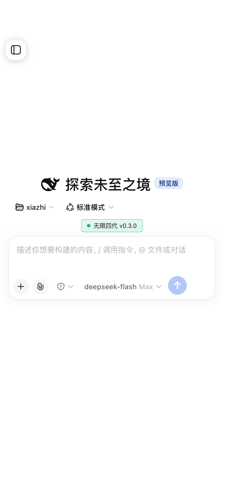 | 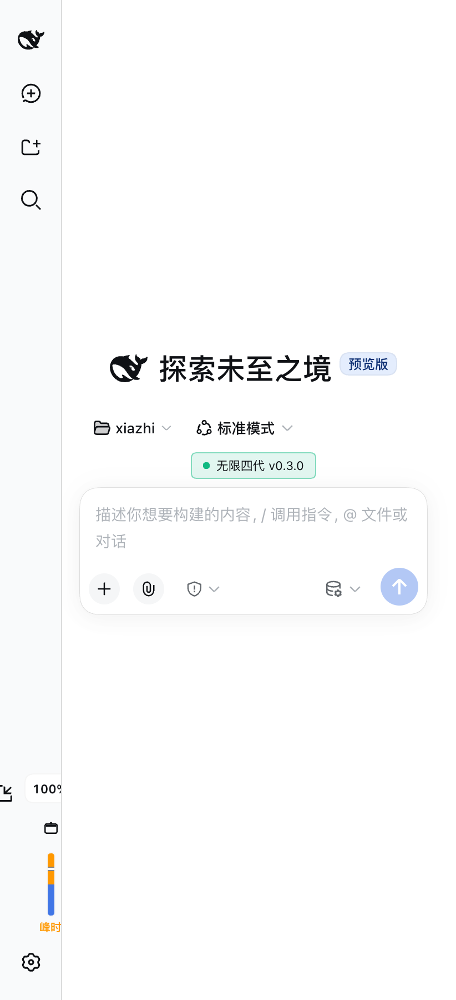 |

> 断点字符串若被 DSH 改掉，这段覆盖会**静默失效退化成「自动」**，不会把页面弄坏。
> 主文档抓取失败时同样返回 `null` 交回 WebView 走原路。

同一处还顺手补了 polyfill 兜底（`crypto.randomUUID` / `AbortSignal.any`）——
上游代理补过就不重复补，所以用 dsh-lan、dsh-pocket 时不会叠加。

---

## 四、这个客户端**不做**什么

DSH 界面里已经有会话列表（侧栏抽屉）、新建会话、模型切换、工具调用卡片、审批……
原生层**全部不重复**。会话切换就用 DSH 自己的侧栏。

所以这个 app 没有「首页」：配好地址之后，打开就是 DSH 界面。

## 五、这个客户端**做**什么

只做 DSH 界面做不到、或者在自己页面里做起来别扭的四件事：

| 能力 | 为什么原生做 |
|---|---|
| **与 dsh-pocket 的握手** | 手机不能直连 `127.0.0.1:3080`（`/api` 有 loopback 栅栏）；要在原生侧手动跟重定向收 `Set-Cookie`，绕开过渡页与限流 |
| **入口地址管理** | DSH 页面里改不了自己从哪加载 —— 换网络（局域网 / Tailscale）必须能改 |
| **界面缩放** | 手机看 DSH 的桌面布局嫌小、平板嫌大，需要整体缩放 |
| **崩溃自记录** | 手机端崩溃难复现，让 app 自己把栈留下来 |
| **会话完成通知** | 页面在后台会被系统挂起，收不到「跑完了」；原生侧维持一条事件流才能推通知 |
| **附件选择器托管** | WebView 里 `<input type="file">` 必须宿主接管，否则点了没反应 |

外加一个顶部 **44dp 状态条**（宿主机信息的唯一原生入口）：

```
● 10.0.0.2           ⟳  ⚙
──────────────────────────────
      DSH 界面（WebView）
```

- 左边：连的是哪台机器
- ⟳ **重新加载**：先重握手换新凭据再加载（Mac 上重启过 `dsh web` 后旧 cookie 会 401，单纯 reload 没用）
- ⚙ **设置**：入口地址（可改）/ 界面缩放 / 会话内布局 / 屏幕常亮 / 清除登录

---

## 六、架构

```
┌─ MainActivity ────────────────────────────────┐
│                                               │
│   WebView（常驻）  ← DSH 界面，不销毁           │
│                                               │
│   Compose 层       ← 状态条 / 连接页 / 设置      │
│                                               │
└───────────────────────────────────────────────┘
        │ 原生握手（HttpURLConnection）
        ▼
   dsh-pocket :3081 ──▶ dsh web :3080
```

WebView 常驻的意义：「设置 → 改地址 → 连回来」不会丢掉页面状态。

### 握手为什么必须在原生侧

`dsh-pocket` 的首屏流程是：**注入 launch token → 上游 303 下发 `dsh-auth-*` cookie →
改写成 200 过渡页 → meta-refresh 回 `/` → 才进真正的 GUI**。

丢给 WebView 跑会有三个副作用：

1. 历史记录多一项
2. 每次失败都累加 pocket 的**握手重试计数**（3 次 / 60 秒），超了直接 503 卡死
3. Safari 系内核在 `http://` + 纯 IP 源上**不保存** 3xx 下发的 cookie → 死循环

所以 `Handshake.java` 手动跟重定向（最多 6 跳）、逐跳收集 `Set-Cookie`、灌进
`CookieManager`，之后再让 WebView 加载 —— 首屏直接是 GUI，且「Mac 是否可达」
变成一次能给出具体原因的可报错探测。

### 键盘遮挡输入框（Android 15 的坑）

**现象**：输入法弹起时，DSH 的输入框被压在键盘底下，打字时看不到自己在打什么。

**原因**：Android 15 起对 `targetSdk 35` **强制 edge-to-edge** —— 窗口不再为系统栏和
输入法让位，manifest 里的 `android:windowSoftInputMode="adjustResize"` 随之失效。
WebView 保持全高，而 DSH 的输入框是 `position: fixed; bottom: 0`，于是正好落在键盘后面。

**修法**：应用自己把 inset 吃掉。

```kotlin
enableEdgeToEdge()                       // 统一各版本的 inset 语义
...
AndroidView(modifier = Modifier
    .windowInsetsPadding(
        WindowInsets.navigationBars.union(WindowInsets.ime),
    ))
```

两个细节：

- 用 `union`（逐边取较大值）而不是把两个 padding 相加 —— 键盘弹起时系统会同时报
  导航栏和输入法两条 inset，简单相加会多顶出一条导航栏的高度。
- 连接页的原生输入框同样加了 `imePadding()`，否则首次配置时输地址也会被挡。

实测结果：

| 系统 | 结果 |
|---|---|
| Android 15 / API 35（强制 edge-to-edge） | WebView 高度 `2085 → 1265`，输入框完整可见；收起后恢复 2085 ✓ |
| Android 10 / API 29（传统 inset 路径） | 同样正常，且**没有双重 padding** ✓ |

两代实现（API 30 前的 compat 合成 / API 30+ 的原生 `Type.ime`）都验过。

| 键盘弹起时的 DSH | 连接页同样处理 |
|---|---|
| 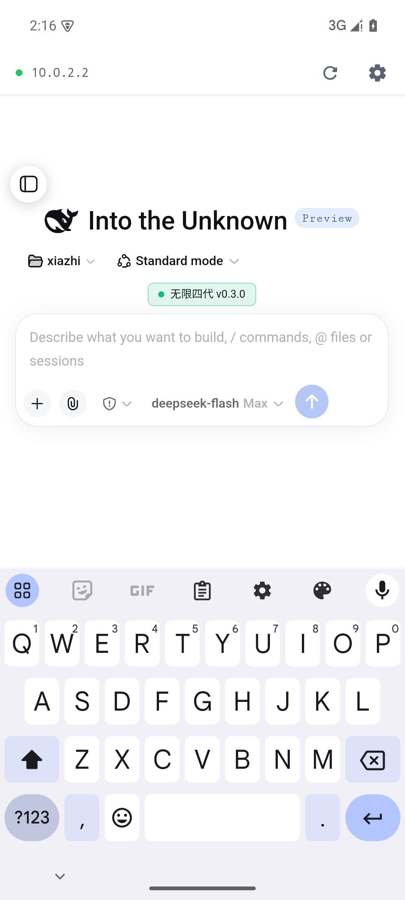 | 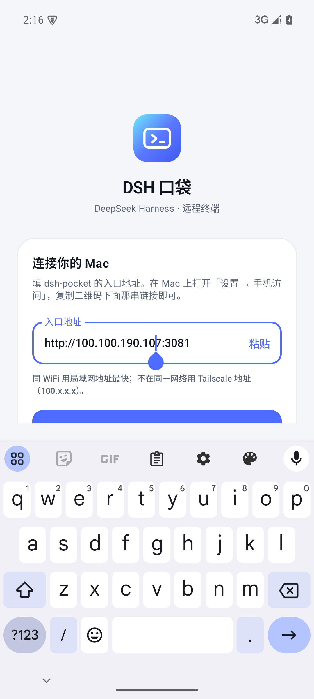 |

### 界面缩放为什么用 CSS `zoom`

`WebSettings.setTextZoom` 只放大字号，**盒子、内边距、图标不跟着长**，结果是文字挤在
一起、排版崩掉。`zoom` 把整棵子树连尺寸一起等比放大，才是真正的「整体大小」。

实测确认：`zoom` **不改变 CSS 视口宽度**（390px 在任何倍率下都不变），所以 DSH 的
`matchMedia('(max-width:1023px)')` 布局判定不受影响 —— 放大后仍是原来的手机/桌面形态，
只是都变大。底部固定输入框在各倍率下也都在视口内。

| 130%（真机） | 155%（浏览器验证） |
|---|---|
| 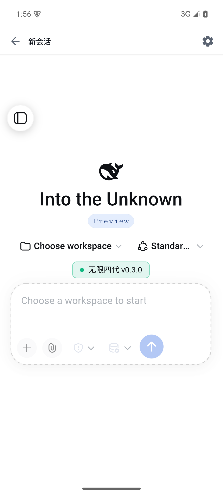 | 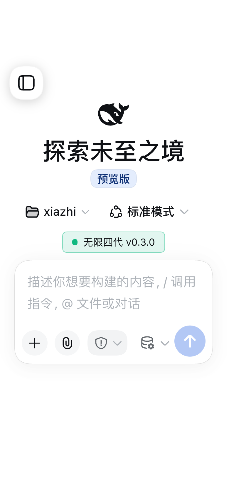 |

> 原生状态条**不跟着缩放** —— 缩放的是 DSH 界面，不是 app 自己。

---

## 七、崩溃怎么排查

手机上的崩溃很难复现（ROM、系统版本差异），所以 app 会自己把栈写下来：

- 未捕获异常 → 写入 `filesDir/last-crash.txt`（**不需要任何存储权限**），同时打到 logcat
- **下次启动自动弹出对话框**，可滚动、可选中、一键复制
- 仍然交还给系统默认处理器，**不吞异常** —— 吞掉会变成半死状态，比闪退更难查

报告里已带厂商 / 型号 / Android 版本 / ABI / app 版本。

```bash
adb logcat -b crash -d | tail -60          # 只看崩溃缓冲
adb logcat -d | grep -i dsh.remote         # 应用相关
adb shell run-as com.dsh.remote cat \
  /data/data/com.dsh.remote/files/last-crash.txt   # 直接取文件（debug 包）
```

---

## 八、构建

前置：JDK 17、Android SDK（platform 35 + build-tools 35.0.0）。

```bash
export ANDROID_HOME=/opt/homebrew/share/android-commandlinetools
export JAVA_HOME=/Library/Java/JavaVirtualMachines/jdk-17.jdk/Contents/Home

cd ~/dsh-android
./gradlew :app:assembleRelease
# → app/build/outputs/apk/release/app-release.apk   (1.4 MB)
```

安装：

```bash
adb install -r app/build/outputs/apk/release/app-release.apk
```

> **用 release 包。** debug 包 11 MB 且未开 R8；release 开了 R8 + 资源压缩后是 1.4 MB。
> 目前 release 用 debug 密钥签名（个人自用，装得上即可）。要分发就换成自己的 keystore。

---

## 九、用法

1. Mac 上 `dsh web` 在跑，「设置 → 手机访问」里的**局域网访问**是开的
2. 手机装 APK 打开 → 首次是连接页，预填 Tailscale 地址
   - 点「粘贴」可贴从 Mac 设置页复制的链接
   - 或直接把链接**分享**到「DSH 口袋」（注册了 `text/plain` 的 SEND）
3. 连上后就是 DSH 界面；会话列表在 DSH 自己的侧栏抽屉里
4. 顶部状态条 ⚙ 可改地址 / 缩放 / 布局

返回键：优先页面内后退，否则退出 app。设置面板打开时先关面板。

---

## 十、源码结构

```
app/src/main/java/com/dsh/remote/
├── MainActivity.kt          宿主：常驻 WebView + 状态机 + 缩放/布局注入 + 深链 + 组装
├── Handshake.java           原生握手：手动跟重定向收 Set-Cookie
├── WatchService.kt          保活前台服务（让后台也能收到完成通知）
├── CrashLog.kt              崩溃自记录（写 filesDir）
├── DshApp.kt                全局未捕获异常钩子
├── Prefs.java               配置存储（地址 / 布局 / 缩放 / 常亮 / 通知开关）
├── data/
│   ├── DshApi.kt            RPC 客户端：session/list 快照 + $events 事件流（含 waterfall 回执）
│   └── WebViewCookies.kt    与 WebView 共用的 CookieJar
├── web/
│   └── PageInject.kt        页面注入：布局覆盖 + polyfill 兜底
├── notify/
│   ├── SessionWatcher.kt    盯着 running 状态，谁跑完记一条（单例，Activity 与服务共用）
│   └── NotificationCenter.kt 两个通知渠道 + 点击跳转的 PendingIntent
└── ui/
    ├── Screens.kt           连接页 / 握手等待 / 加载遮罩 / 状态条（含铃铛）/ 设置面板
    ├── NoticePanel.kt       通知悬浮窗 + 相对时间
    ├── DshIcons.kt          自绘图标（避免引入 10MB 的 icons-extended）
    └── theme/Theme.kt       设计系统 + 状态栏明暗
```

---

## 十一、系统要求

**需要较新的 Android System WebView（约 Chrome 119+）。**

DSH 的前端产物用了 `Promise.withResolvers` 等新 API。WebView 太老时页面会**整页白屏**，
logcat 里能看到：

```
Uncaught TypeError: Promise.withResolvers is not a function
Uncaught SyntaxError: Unexpected token '{'
```

真机上 WebView 随 Play 商店自动更新，正常不会遇到；**模拟器镜像里是冻结的旧版本**
（Android 10 官方镜像带的是 WebView 91），会踩到。如果你在模拟器上看到白屏，
先升 WebView 或换高版本系统镜像。

app 侧不对此做降级 —— DSH 前端不是我们能改的。

---

## 十二、已知边界

| 项 | 说明 |
|---|---|
| `blob:` / `data:` 下载 | 页面内存生成的文件走不了系统下载器 |
| 摄像头 / 麦克风 | `onPermissionRequest` 一律拒绝 |
| 首次打开 | 若 DSH 弹出「内测声明」，需先点掉（DSH 自身行为） |
| 后台流式 | 息屏后 WebView 定时器被系统节流，回前台自动恢复 |

---

## 十三、后续可做

1. **扫码添加地址**：pocket 设置页有二维码，加 CameraX + MLKit
2. **局域网自动发现**：`ConnectivityManager.getLinkProperties()` 免权限拿本机 IPv4，
   并发探测同网段 `:3081`
3. **完成通知**：任务跑完推一条系统通知
4. **双指缩放**：把缩放滑杆做成手势，直接改 `zoom`

---

## 附：协议文档与工具

**与 dsh-pocket 的关系**：客户端**不再依赖它的私有接口** —— 布局覆盖走
`matchMedia`（`web/PageInject.kt`，实测能驱动 pocket 自己的解析器），polyfill 有兜底，
浏览器会话走 DSH 核心的 `dsh-auth` cookie 机制。

但要分清两层：

| 层 | 谁提供 | 换成 dsh-lan 后 |
|---|---|---|
| 网络可达（手机连到 3080） | dsh-pocket / dsh-lan | ✅ dsh-lan 等价替代 |
| **手机端布局适配** | dsh-pocket（移植自 MIT 的 dsh-web-mobile） | ✅ 装 `dsh-web-mobile` 即可，同一个源 |

装一个包就够：

```sh
dsh plugin --profile web add dsh-lan -w
```

`dsh-lan` 自带两件事：网络桥（它自己）+ 移动端适配（依赖
[`dsh-web-mobile`](https://www.npmjs.com/package/dsh-web-mobile)，MIT，独立维护）。

`docs/PROTOCOL.md` 是实测验证过的 DSH 客户端协议（两种载体、完整 `session/*` API 表、
事件清单）。**当前 app 不直接用这套 RPC** —— 会话列表交给 DSH 自己的界面了 ——
但如果将来要做原生功能（完成通知、扫码建会话），这份文档就是起点。

```bash
node tools/probe-api.mjs       # 会话列表 / 模型目录
node tools/probe-stream.mjs    # 消息历史 + 实时流式
DSH_URL=http://192.168.0.91:3081 node tools/probe-api.mjs
```

`docs/legacy-shell.html` 是 v1 的 HTML 外壳，已被原生 Compose 取代，仅留档。
